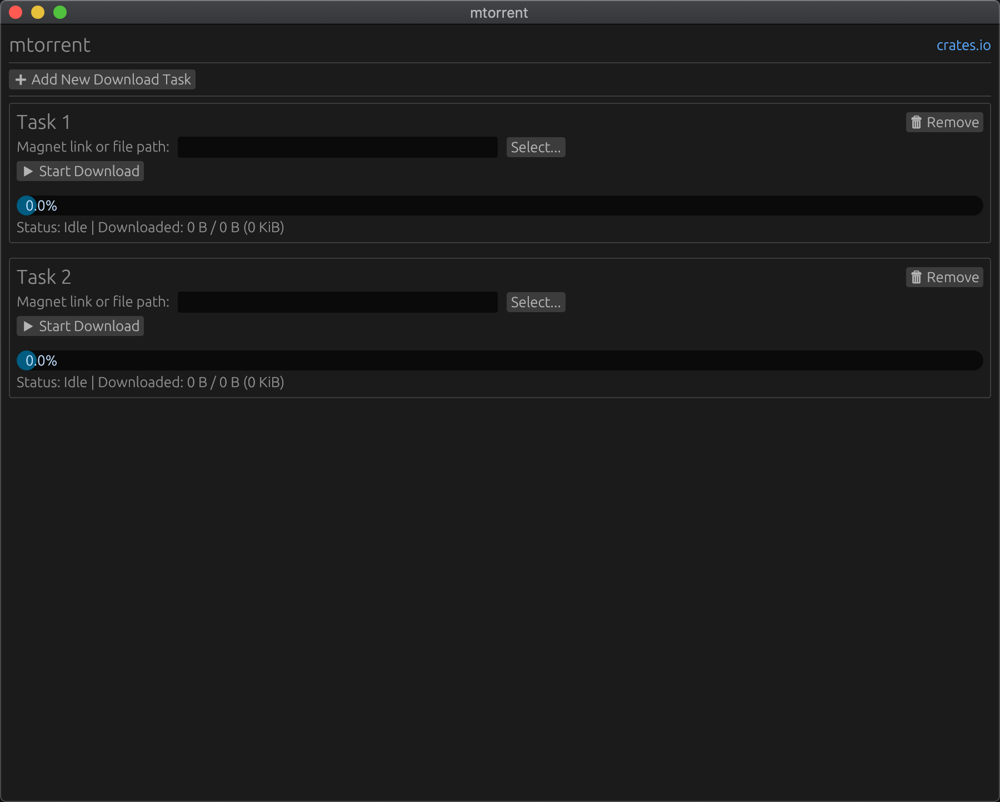

# mtorrent-egui

Simple graphical user interface for [mtorrent](https://github.com/DanglingPointer/mtorrent). Based on egui, tested on MacOS.

BASE ON [mtorrent-gui](https://github.com/DanglingPointer/mtorrent-gui)

